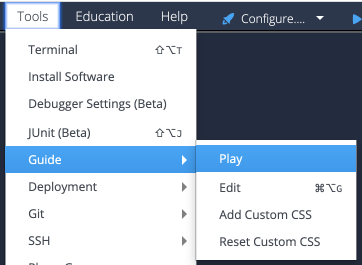

# C++ Unit testing using Google test
This project shows you how to perform C++ unit testing using Google test in Codio. You can use this project as a starting point for your work or you can follow the instructions on the second page to learn how to add unit testing to your own stack.

Feel free to edit and try things out -- if you need a new copy of this project use one of the links below.

For Codio.com users, go to this [starter pack](https://codio.com/home/starter-packs).
For Codio.co.uk users, go to this [starter pack](https://codio.co.uk/home/starter-packs).

## Start the Guide to see the project
If you are seeing this, you are currently in edit mode. To start Guides from this page, go to the tool bar at the top:

